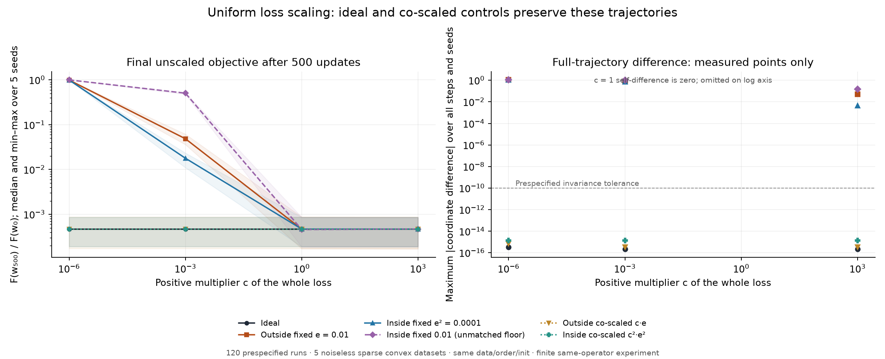

# Controlled sparse least-squares loss-scaling experiment

All **120 prespecified runs passed**. Uniformly scaling the whole loss preserved the ideal AdaGrad trajectories to ordinary floating-point precision on these five datasets. Fixed stabilizers changed the trajectories; scaling each stabilizer with its physical units restored the corresponding baseline trajectories. This is a bounded same-operator computation, not independent external replication or a model-performance benchmark.

## Fixed setup and provenance

The protocol was saved at **2026-09-13T11:35:25.544573Z**, before optimizer execution. The dataset/code/protocol manifest was saved at **11:41:17.892900Z**. This establishes local artifact order, not independently timestamped preregistration.

- Seeds: **17, 29, 43, 71, 101**; each generates a separate fixed dataset and sample order.
- Each dataset has **120 rows and 24 coordinates**. Its first 24 rows are the unit basis; the remaining 96 have three nonzeros. Labels are noiseless dot products with a saved known coefficient vector.
- The unit basis guarantees full column rank and therefore a unique least-squares minimizer. Every saved minimizer evaluates to exactly zero loss and gradient in this implementation.
- Positive whole-loss scales: **10⁻⁶, 10⁻³, 1, 10³**. Multiplying the entire objective by a positive constant preserves its minimizer. Features and parameters are unchanged.
- Each of six variants takes **500 single-sample updates**, with the same saved shuffled-epoch order, zero initialization, zero accumulators and learning rate **0.25**. There is no projection, regularization, clipping or observation noise. Sample gradients vary with the row and current iterate; this is a deterministic incremental method, not full-batch gradient descent.
- No grid, seed, epsilon, learning rate or ordering was changed after inspecting results. All runs and all checkpoint metrics are retained.

The simulation uses Python's standard library only: CPython **3.14.3**, macOS **15.3**, ARM64. The measured run took **0.928 seconds**. The exported figure uses installed matplotlib only; its exact version and output hashes are in `PROVENANCE.json`. No downloaded paper code was executed.

The source starting point is the diagonal adaptive update in [Duchi, Hazan and Singer (2011), Eq. 1](https://jmlr.org/papers/volume12/duchi11a/duchi11a.pdf). The epsilon variants and zero-denominator convention below are explicitly specified for this experiment; we do not attribute them to that equation. The retained source PDF has SHA256 `691043712c05c19c98223fba52507beff0480afb11fa17ea40a2a032d6f0bf3c`.

## Update and units

For the current sparse sample, form the residual once before updating any coordinate. Let `g` be that sample gradient multiplied by `c`, and update each coordinate's inclusive accumulator `S ← S + g²`. The parameter step is `−0.25·g / denominator`.

| Variant | Denominator |
|---|---|
| Ideal | `sqrt(S)` |
| Outside fixed | `sqrt(S) + 0.01` |
| Inside matched fixed | `sqrt(S + 0.0001)` |
| Inside same numeric, unmatched | `sqrt(S + 0.01)` |
| Outside co-scaled | `sqrt(S) + c·0.01` |
| Inside matched co-scaled | `sqrt(S + c²·0.0001)` |

When both gradient and accumulator are zero, the ideal step is explicitly zero. Untouched sparse coordinates also remain fixed. This is our declared implementation convention, not a claim that an ordinary inverse at zero was automatically defined in the paper's Eq. 1. The active zero-denominator branch was exercised **28 times** across the experiment.

An outside epsilon has gradient units; an inside epsilon has squared-gradient units. The outside value `e = 0.01` and inside value `e² = 0.0001` have the same zero-gradient denominator floor. They remain different functions at positive `S`. Reusing the numeric value `0.01` inside gives a floor of `0.1`, ten times larger: that variant is a separate convention, not a dimensionally matched winner comparison.

## Separate algebraic argument

For the same sample sequence and deterministic oracle, suppose the scaled and unscaled iterates agree through the previous step. Scaling the whole objective by `c > 0` then gives `g_c = c·g`, and zero-initialized inclusive accumulators give `S_c = c²·S`. Thus `sqrt(S_c) = c·sqrt(S)`. The factor `c` cancels from the ideal update. Zero-gradient/zero-accumulator coordinates agree under the explicitly declared zero-step convention. Induction gives identical exact-arithmetic trajectories.

The same induction works with outside epsilon `c·e` or inside epsilon `c²·e²`. With fixed epsilon, factoring `c` out of the denominator instead leaves an effective outside stabilizer `e/c`, or an effective inside stabilizer `e²/c²`; the original homogeneity is absent. That absence does not mean every dataset must show a difference. The finite test below demonstrates one prespecified dataset family where differences occur. Floating-point checks test the implementation; they are not the proof above.

## Results

The comparisons inspect **every coordinate at all 501 states**, not only checkpoints or supplied gradient sequences. Each run retains a full-trajectory SHA256 plus the actual weights, unscaled full objective and unscaled full-gradient Euclidean norm every 25 updates. Full trajectories were compared in memory; the saved dataset and code regenerate them.

| Prespecified trajectory check | Cases | Observed maximum absolute coordinate difference | Outcome |
|---|---:|---:|---|
| Ideal vs. same-seed ideal at `c=1` | 15 nonunit-scale comparisons | **3.3306690738754696×10⁻¹⁶** | All ≤ 10⁻¹⁰ |
| Co-scaled epsilon vs. its same-seed fixed-epsilon baseline at `c=1` | 40 comparisons | **1.4155343563970746×10⁻¹⁵** | All ≤ 10⁻¹⁰ |
| Fixed stabilizers at `c=10⁻⁶` vs. their own same-seed `c=1` baseline | 15 comparisons | Each run's maximum ranged **0.9924821509668891–1.0864917116903527** | All > 10⁻⁶ |

There are **70 prespecified trajectory checks**, plus **50 descriptive trajectory comparisons**. Every run remained finite. Ten of the fixed-stabilizer checks use the matched-floor pair; five use the separately labeled unmatched convention.

The following values are **five-seed medians of the final unscaled objective divided by its initial value**. Full per-seed values, ranges, unscaled losses and gradient norms are in `results.json`.

| Whole-loss scale | Ideal | Outside fixed | Inside matched fixed | Inside same numeric, unmatched |
|---:|---:|---:|---:|---:|
| 10⁻⁶ | 0.000469059 | 0.992951 | 0.992940 | 0.999291 |
| 10⁻³ | 0.000469059 | 0.0485967 | 0.0178422 | 0.505470 |
| 1 | 0.000469059 | 0.000466850 | 0.000468920 | 0.000456798 |
| 10³ | 0.000469059 | 0.000469056 | 0.000469059 | 0.000469059 |

The co-scaled outside median stays approximately **0.000466850** at all four scales, and the co-scaled matched-inside median approximately **0.000468920**. At `c=10⁻⁶`, the fixed matched-floor variants retain about **99.3%** of initial loss after the fixed 500-update budget; their co-scaled controls retain about **0.047%**. The corresponding median unscaled full-gradient norms are about **0.8174**, compared with about **0.01349–0.01352** for those controls.



Figure: shaded bands are the five observed seed minima and maxima, not confidence intervals. Left-panel lines only connect measured grid points. The right panel shows scatter-only measured points: `c=1` self-comparisons are zero and omitted from the logarithmic plot. Each co-scaled variant uses its own fixed-epsilon `c=1` baseline. Near-overlapping control curves are expected. An editable vector export is `loss-scaling.svg`; the corrected PNG was visually inspected for clipping and legibility. This corrected render removes lines across the unplotted zero baseline in the right panel. No simulation result changed.

## Scope and computational claim

These results support a precise implementation-level observation: **in this fixed 120-run experiment, ideal and dimensionally co-scaled variants preserve the recorded trajectories within the predeclared tolerance, while all fixed-stabilizer small-scale cases differ substantially, even though every positive loss scale has the same unique minimizer**. This is not evidence of a universal optimizer ranking, convergence rate, new theorem, independence of reviewers, or performance on noisy data, neural networks, feature scaling or other software frameworks.

`claim.json` supplies the exact numeric statement, counts, assumptions, limitations and artifact pins for any later attributed claim record. The original experiment did not submit a chain claim. This evidence publication does not itself create one.

The public `MANIFEST.json` binds every payload file. Obtain its expected SHA256 from the evidence page or a specific claim before execution; a hash supplied only by an untrusted download does not establish authorship or truth. Public `results.json` is the complete canonical computational object, SHA256:

`55f0f8d77b07f81b218ffe808342a6c6c89b80f434bd04cb4f2baffa73e0b787`

This is the same scientific content hash as the original execution. Package-relative reproduction verifies all files before calling the unchanged optimizer:

```sh
python3 -I -B reproduce.py --manifest-sha256 EXPECTED_SHA256 --output my-result.json
```

Use a fresh output file; nothing is overwritten. A mismatch is retained in that output and returns a nonzero exit status. Compare `exact_result_match`, `prespecified_checks_pass` and the complete `computation` object. Exact float equality is observed on the original Python/platform and is not promised on every system. Matching an existing result is computational reproduction; it is not by itself independent scientific review.

See `README.md` for retrieval, verification, licence and reviewer instructions, and `PROVENANCE.json` for the source/computation distinction and precise packaging transformations.
