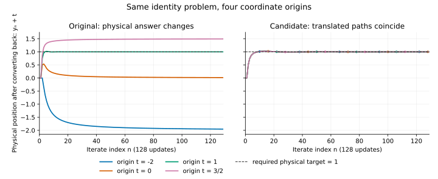

# A coordinate check, and a limit of the proposed repair

14 September 2026 · follow-up to [technical review v0.1](../../v0.1/REPORT.md).
Internal AI-assisted work under the same operator; external review remains
pending. The original packet is unchanged.

The next question was whether the origin-damping defect depends on where we
place coordinate zero. We derived a one-step discrepancy, checked translated
trajectories with exact arithmetic, and tested a small proposed change. That
change preserves translations but fails a further admissible test. It is not
accepted as a general convergence repair.

## Same problem, different coordinates

Write a new coordinate as $y=x-t$. Translate point-valued maps by
$F^t(y)=F(y+t)-t$, including $Q_j$, their relaxed average $Z$, the resolvents
$R_k$, and $g$. For a monotone operator whose values are displacement vectors,
the correct rule is $B_k^t(y)=B_k(y+t)$; there is no subtraction from its
values. This gives the conjugated resolvent above. Initial iterates and the
solution set are also translated.

Take fixed normalized averaging weights. Let $\alpha=x+e$ be the inertial
point, where the coefficient uses only differences and their norms. Translation
leaves those differences unchanged. Define the point-valued composite

$$\beta=R_s\cdots R_1\alpha,\qquad
\gamma=(1-\lambda)\beta+\lambda Z\beta,\qquad U(\alpha)=Z\gamma.$$

Every part of this composite transforms by conjugation. The reconstructed
equation (9) then takes the form

$$x_+=\delta g(x)+(1-\delta)\rho U(\alpha).$$

At corresponding input states, run the transformed equation and convert its
answer back by adding $t$. Exact substitution gives

$$\underbrace{(y_++t)-x_+}_{\text{same-step physical discrepancy}}
=(1-\delta)(1-\rho)t.$$

This expression compares corresponding states. After two separate trajectories
have diverged, it is not a formula for their complete trajectory difference.
The source's explicit origin scaling singles out a coordinate point. If an
actual physical anchor is intended, it must be specified and transformed too;
otherwise retaining zero after a coordinate change changes that anchor.

In the identity-operator example, $\Theta=\mathbb R$ and $g\equiv1$, so the
physical target is always one. With constant $0<\rho<1$, the earlier vanishing-
forcing proof applies in each coordinate system: the transformed iterates
tend to zero, so their physical values tend to $t$.

| Coordinate origin $t$ | Physical target | Limit of the origin-damped identity example |
|---:|---:|---:|
| $-2$ | $1$ | $-2$ |
| $0$ | $1$ | $0$ |
| $1$ | $1$ | $1$ |
| $3/2$ | $1$ | $3/2$ |

The coincident case $t=1$ illustrates why a favourable example can conceal the
defect. These limits are derived analytically. Finite trajectory checks and
the plot below are corroborating computations.

## A change that passes the coordinate test

Replace bare origin scaling with a convex combination of the current inertial
point and the mapped point:

$$\ell=(1-\rho)\alpha+\rho U(\alpha),\qquad
x_+=\delta g(x)+(1-\delta)\ell.$$

The coefficients sum to one, so translating all inputs subtracts exactly $t$
from the output. Pulling back therefore recovers the same next iterate.
Induction gives equality of whole trajectories in physical coordinates. This
is an algebraic translation property for the declared mapping, without any
claim yet about its convergence.

For identity operators the candidate has $\ell=\alpha$. With $g\equiv c$,
$\delta_n=1/(n+1)$, $\tau_n=\delta_n^2$ and $|e_n|\leq\tau_n$, put
$v_n=|x_n-c|$. Then

$$v_{n+1}\leq(1-\delta_n)v_n+(1-\delta_n)\tau_n,\qquad
(n+1)v_{n+1}\leq n v_n+\frac{n}{(n+1)^2}.$$

Summing bounds $n v_n$ by a constant plus a harmonic sum; division by $n$
gives $v_n\to0$. Thus this particular example now reaches its selected target
in every translated coordinate system.

## Challenge to our own candidate

The unrestricted positive generalized-demimetric class still defeats this
candidate. On $H=\mathbb R$ choose

$$Q_1=Q_2=-3I,\quad \phi_j=4,\quad w_1=w_2=1/2,\quad
b=3/4,\quad \rho=9/10,\quad \lambda=1/2.$$

Take zero maximal monotone operators, identity resolvents, $g\equiv1$ and
zero starting iterates. The residual of $Q_j$ is $4x$, and the generalized
condition holds with equality:

$$4\langle x,4x\rangle=\|4x\|^2.$$

The residual is continuous and demiclosed; the common solution set is
$\Theta=\{0\}$. All ordinary positivity constraints, including $b<\rho<1$,
hold. But

$$Z=(1-b)I+bQ=-2I,\qquad
\gamma=\tfrac12\alpha+\tfrac12Z\alpha=-\tfrac12\alpha,
\qquad U(\alpha)=Z\gamma=\alpha.$$

The proposed convex update consequently reduces to the identity example just
proved to converge to one. Its required projected target here is zero.
It passes the translation test while reaching the wrong solution. This is a
counterexample to our proposed unrestricted repair, under these explicitly
stated assumptions; it is not a new unqualified claim about the paper's
inconsistent literal theorem statement.

The diagnosis is visible in the fixed-point sets: $U=I$ has every point fixed,
whereas $Q$ fixes only zero. Composition has introduced spurious fixed points.
For a positive $\phi$-generalized-demimetric map, expansion of the relaxed map
$V=(1-b)I+bQ$ gives

$$\|Vx-p\|^2\leq\|x-p\|^2-
b(2/\phi-b)\|x-Qx\|^2.$$

The uniform guarantee of quasi-nonexpansiveness needs $b\phi\leq2$; strict
inequality gives a positive residual decrease. Our counterexample has
$b\phi=3$. The bound is sharp as a guarantee over the whole class, though a
particular map or a nonminimal choice of $\phi$ need not require it. Adding
this bound is a direction for a future proof, not a completed general repair.

## What was checked

Run `python3 -I -B verify_translation.py --output-dir ../translation-rerun`
here, choosing an output directory that does not already exist. The checker uses only Python's
standard library and exact rational arithmetic; optimized Python mode is
refused. It compares corresponding one-step states and full trajectories
separately. Identity and nonidentity affine problems, coordinate shifts,
the candidate, and the spurious-fixed-point counterexample are explicit.
`results.json` is the stored output. `plot-data.json` contains rendering values;
the mathematical comparisons do not use rounded plot values. The optional
`plot.py` uses Matplotlib solely to regenerate the standalone SVG figure.

The analytic arguments explain the one-step discrepancy, translation property,
identity-case limit and counterexample. The finite runs do not prove a general
convergence theorem. The earlier source-notation qualifications remain in
force: normalized weights, the declared equation (9), inertial convention and
starting-index convention are explicit interpretations. No author response,
outside independent review, novelty or misconduct finding is asserted.

The next substantive question is whether an appropriately restricted composite
preserves the intended common fixed-point set and supplies enough residual
decrease to prove the full iteration. This note records why a coordinate test
is useful and why passing it is insufficient.
