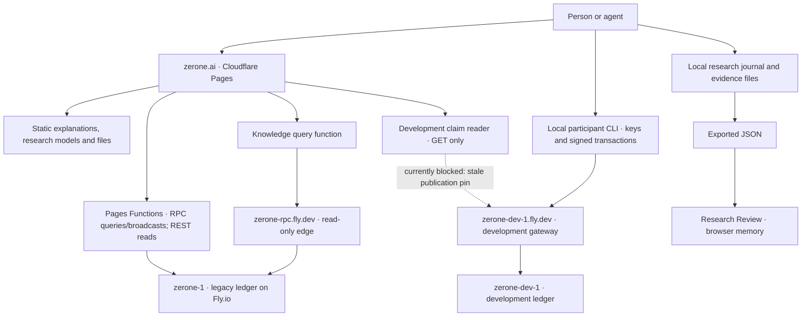
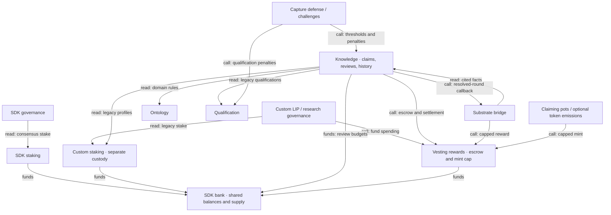
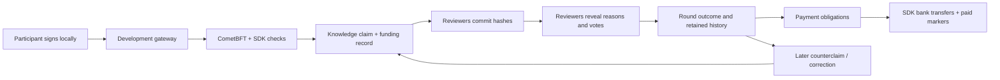

# Zerone: what exists and how it connects

**Snapshot: 17 September 2026.** Source reviewed: GitHub `main` at
[`cb12a457`](https://github.com/cambridgetcg/zerone-core/tree/cb12a457b15fb21ebc42d9fb9b6414c161c194cc).
This is a map of the system, not an instruction to upgrade or launch a network.
“In source” means implemented in that checkout; “observed” means a dated endpoint
or infrastructure observation. A successful query is not an independent state proof.

Read the [overview](#the-one-minute-map), then jump to
[infrastructure](#networks-and-infrastructure), [modules](#inside-one-zeroned-process),
[flows](#follow-the-main-flows), [storage](#where-data-lives),
[integrations](#external-connections-connected-optional-or-only-designed), or
[unfinished connections](#the-main-unfinished-connections).

## The one-minute map

Zerone has five main pieces:

1. **A public front door: `zerone.ai`.** Explains the project, displays the legacy
   ledger, links participation tools, and hosts research readers.
2. **A blockchain application: `zeroned`.** A Go program built on Cosmos SDK and
   CometBFT. Accounts sign transactions; modules record claims, reviews, money
   and other state; validators agree on blocks.
3. **Separate networks running different versions.** `zerone-1` is the legacy
   custodial ledger. `zerone-dev-1` is the shared development network for claim
   work. `zerone-testnet-1` is an older test network. `zerone-2` is an unactivated
   successor release kit. They are not aliases for one chain.
4. **Local tools and clients.** The CLI, TypeScript SDK and Python helpers prepare
   signed actions, run nodes, inspect records, or preserve research files.
5. **Research and integration designs.** Static models, local journals and
   experimental adapters sit beside the chain. Their existence does not make
   them consensus modules, live services, or payment systems.

The present product direction is **attributed claims → reasoned reviews →
retained challenges/corrections → settlement of explicitly funded work**.
Recording a review outcome does not establish scientific truth. The broader
codebase still contains older economic, scoring and governance machinery.

## The system from outside

The homepage's legacy wallet can also submit a signed bank transfer through its
RPC relay. **The development browser page only reads**; development transactions
and faucet requests come from the participant client. These are different routes.
The read-only `zerone-rpc` edge does not mediate every website request.
The separate `/research/` library loads pinned static JSON models; its diagrams
are not live chain queries. `/understand/`, `/nodes/` and their `guide.json` files
are documentation, not enrollment or agent-protocol endpoints.

Source: [website build](../dashboard/vite.config.ts),
[RPC/REST proxy](../dashboard/functions/api/_proxy.ts),
[knowledge proxy](../dashboard/functions/api/_knowledge.ts),
[development reader](../dashboard/src/development-reader.ts),
[development gateway](../deploy/networks/zerone-dev-1/gateway.py).

## Networks and infrastructure

| Piece | Job | What is established |
| --- | --- | --- |
| **Cloudflare Pages / `zerone.ai`** | Static frontend, research files and Pages Functions | Public website; its live development guide identifies source `cb12a457`. |
| **Fly.io / `zerone-1`** | Historical custodial ledger and its RPC/REST services | Public status responds as `zerone-1`; this is an older application lineage, not a deployment of current `main`. |
| **Fly.io / `zerone-rpc`** | Stateless, restricted HTTPS access to legacy queries | Public `/rpc/status` responds; the knowledge view uses this edge. It is not an independent validator. |
| **Fly.io / `zerone-dev-1`** | Persistent shared development node, gateway and prefunded faucet | Public runtime reports knowledge **11**, source `5542b221`; separate genesis, state and development funds. |
| **Fly.io / `zerone-testnet-1`** | Legacy testing/history | Responding as the separate old test ledger; current-source join scripts are not a compatibility promise. |
| **`zerone-local-*`** | Disposable local development and workflow exercises | Runs on a participant's own machine; test actors and funds. |
| **Legacy observer package** | Let another operator keep a non-signing copy of `zerone-1` | Separately pinned legacy build and signed bootstrap material; it does not add consensus voting power. |
| **`zerone-2` release kit** | Prepare a future successor, private validator and public query edge | Source/rehearsal machinery; launch remains unactivated. |
| **GitHub** | Canonical source, PR checks, releases and downloadable packages | `cambridgetcg/zerone-core`; the historical Codeberg remote is a separate lineage. |

Read-only checks around **12:28 UTC** observed legacy mainnet at height
**1,284,199**, legacy testnet at **2,278,098**, and development at **427,212**;
all reported `catching_up=false`. Legacy nodes reported CometBFT 0.38.19 and
development reported 0.38.25. These heights are dated observations, not fixed
checkpoints or promises of availability. The
[observation record](reports/zerone-map-observations-2026-09-17.json) preserves
public responses and a minimal infrastructure inventory.

**A live publication gap:** on 17 September the development runtime reports
knowledge 11 at `5542b221864ca0080e143fa82abbef4cd2064f71`. A separate
`AppliedPlan` query reports `knowledge-fund-settlement-v1` applied at height
**300,000**. The website's
[`development/guide.json`](https://zerone.ai/development/guide.json) still selects
the original `ac5684e33b6946a31f6ea260ebf280eace55b033` package and labels the
upgrade proposed. The original genesis still needs the predecessor binary for
replay; old participant homes have their own pinned files. This map does not
replace those pins or constitute a successor-package publication.

This affects use today: calling the current reader's `verifyDescriptor` with
the served descriptor and published pins **rejects it before claim history is
fetched**. The expected hash starts `e01f9e47`; the served hash starts
`768d7dd7`. Its message is “Network descriptor differs from the published
SHA-256; stop and check the network notice.” Thus the diagram shows the intended
read route, with this publication mismatch presently blocking it. See
[descriptor check](../dashboard/src/development-reader.ts) and
[read sequence](../dashboard/src/development.ts).

The accessible Fly account contains **five running machines across four apps**,
plus a stopped release workstation. All are in **London (`lhr`)**:

| App / role | Observed machines | Memory / CPU per machine | Disk and provider snapshots |
| --- | --- | --- | --- |
| Legacy mainnet | 1 running | 4 GiB / 2 shared CPUs | Encrypted 20 GB; 37 snapshots, 60-day retention; latest 17 Sep 10:40 UTC. |
| Legacy testnet | 1 running | 4 GiB / 2 shared CPUs | Encrypted 20 GB; 14 snapshots, 14-day retention; latest 16 Sep 18:56 UTC. |
| Shared development | 1 running | 4 GiB / 2 shared CPUs | Encrypted 20 GB; 5 snapshots, 5-day retention; latest 16 Sep 21:13 UTC. |
| Compatibility RPC edge | 2 running | 256 MiB / 1 shared CPU | Stateless; no mounted volumes. |
| Release workstation | 1 stopped | 8 GiB / 4 performance CPUs | Encrypted 30 GB; 11 snapshots, 14-day retention; latest 16 Sep 21:02 UTC. |

The development node's persistent `/data` volume holds its node home and faucet
accounting. HTTPS reaches its gateway on internal port 8080; P2P uses 26656.
Its RPC is local to the gateway; public REST and gRPC are not separate
development services. See its
[Fly configuration](../deploy/networks/zerone-dev-1/fly.toml) and
[runtime guide](../deploy/networks/zerone-dev-1/README.md).

The **legacy mainnet still has direct RPC/REST/P2P/gRPC service exposure**;
direct public RPC was checked. Its HTTPS compatibility edge is an extra filtered
entrance, not proof of a private signer. The future `zerone-2` topology instead
separates a private validator, a non-signing edge node and a query-only gateway.
No successor, archive or sentry apps appeared in the accessible Fly inventory;
this does not establish absence in every other account/provider.

Fly HTTP health checks are configured for the edge and development gateway.
Recent provider snapshots exist, but this pass did not test restores or
off-provider backups. A separate Prometheus/Grafana/alert-delivery deployment
was not verified. See the [current edge](../deploy/RPC_EDGE.md) and
[successor runtime](../deploy/networks/zerone-2/runtime/README.md).

The February [multi-provider production stack](infrastructure/PRODUCTION-STACK.md)
is explicitly a **plan**: Hetzner/OVH validators, AWS sentries/RPCs, Hermes
relayers, Grafana and a snapshot storage box are not established deployments
just because that document names them.

## Inside one `zeroned` process

The modules below are Go components in **one application**, not 40 separately
deployed microservices. A *keeper* is the code through which a module reads or
changes its state. `app/app.go` constructs keepers and hands them the other
keepers they need.

The reviewed source declares Go **1.25.14**, Cosmos SDK **0.53.8**, CometBFT
**0.38.25** and IBC-Go **10.7.0**. Those are source pins; they do not describe
every running legacy binary. See [go.mod](../go.mod).

### The 17 SDK / IBC modules

| Group | Registered modules | Responsibility |
| --- | --- | --- |
| Accounts and money | `auth`, `vesting`, `bank`, `feegrant` | Signing accounts/sequences, account vesting, balances/transfers, fee allowances. |
| Consensus and its economics | `staking`, `distribution`, `slashing`, `evidence`, `consensus` | Validator set/stake, fee distribution, liveness/equivocation consequences and consensus parameters. |
| Decisions and startup | `gov`, `upgrade`, `genutil` | Ordinary SDK proposals/execution, named upgrade boundaries and genesis transactions. |
| Interchain transport | `ibc`, `transfer`, `interchainaccounts`, `07-tendermint`, `06-solomachine` | IBC routing, token transfers, remote-account machinery and light clients. |

There is no registered SDK `mint` or `authz` module in this inventory. Cosmos
`auth`/`staking`/`gov` and Zerone's similarly named custom modules are distinct.

### The 23 Zerone modules

This table describes **current source wiring**, not a claim that every path is
enabled on every network. Native genesis, parameters, named upgrades and release
profiles decide availability. None of these 23 modules has been removed merely
because the consolidation plan proposes doing so.

| Module in `x/` | Plain-language job | Main connections |
| --- | --- | --- |
| `knowledge` | Claims, commit/reveal reviews, facts, challenges, retained history and review settlement; also older training/ecology logic | Bank, custom staking, ontology, qualification, auth, vesting, counterexamples, capture defense, alignment and substrate bridge. |
| `counterexamples` | Structured counterevidence and its validation records | Reads knowledge facts; feeds a knowledge weighting path. Separate from knowledge's own challenge records. |
| `ontology` | Domain definitions and domain lifecycle | Supplies knowledge, qualification, capture defense and alignment. |
| `auth` | Human/agent registration, DIDs, key rotation, freeze and capability controls | Supplements SDK signing accounts; used by transaction checks, knowledge and claiming-pot adapters. |
| `staking` | Legacy custom participation profiles, stake, delegations and custody | Bank/accounts; read by knowledge, custom governance, qualification, emergency, alignment and claiming pots. Separate from SDK consensus staking. |
| `gov` | Legacy LIPs, custom-stake ballots and research-fund spending, phases and seats | Custom staking, vesting, emergency, alignment and creed; bridge attachment is only a dispatch scaffold. |
| `qualification` | Domain qualification, endorsement and stake-escrow records | Bank, custom staking, ontology and knowledge review-policy selection. New neutral reviews do not use qualification weights. |
| `vesting_rewards` | Vesting escrow/releases, fee routing and the shared native mint-cap gate | Bank, SDK staking/distribution compatibility and knowledge; used by claiming pots, tokens and bridge settlement. Automatic block/founder issuance is retired. |
| `tokens` | User-issued tokens, allowances, wrapped assets and optional emissions | Bank and vesting/mint-cap adapter; native emission periods default to disabled. |
| `liquiditypool` | Pools, swaps, LP shares and time-weighted price records | Bank custody; its restricted bank keeper can mint only pool-share denominations. |
| `claiming_pot` | Bootstrap/general-pot admission and claims | Bank, auth, custom staking and capped minting through vesting rewards. |
| `sponsorship` | Patron-funded bounty orders, fulfillment and escrow refunds | Bank and knowledge fact/domain checks; spends existing funds and never mints. Distinct from SDK `feegrant`. |
| `home` | Agent-home records, sessions, keys, guardian alerts and memory references | Bank plus its own stored records. A memory reference is not storage of its content. |
| `creed` | Versioned creed/document pins and council records | SDK governance authority and a custom-governance dispatch primitive; direct authority anchoring is enabled by default. |
| `work_creed` | Genesis-supplied sub-creed pins for useful-work phases | Its own registry; no transaction, query or amendment API in this phase. Default genesis has no pins. |
| `substrate_bridge` | External-work adapter registry, attestations, bonds and delayed settlement | Knowledge, qualification, bank/accounts and vesting; knowledge resolution calls back into it. It does not fetch sources or run adapter compilers. |
| `emergency` | Guardian ceremonies, transaction quarantine, reopening and recovery authorization | Custom staking, transaction checks and both governance paths; quarantine does not itself stop block consensus. |
| `capture_defense` | Capture/concentration analysis and challenge triggering | Ontology, knowledge, capture challenges and pacing inputs. |
| `capture_challenge` | Challenge cases, bonds and their consequences | Capture-defense metrics, qualification and knowledge thresholds. |
| `alignment` | Health observations, corrections and pacing | Reads knowledge, custom staking, ontology, emergency and vesting; supplies pacing to knowledge/capture defense and health to custom governance. |
| `training_provenance` | Derived training-provenance queries | Stateless reader of knowledge, qualification and capture challenges. |
| `trust_score` | Derived trust-score queries | Stateless reader of the same three sources; not an independent ledger. |
| `ibcratelimit` | Limit traffic through IBC transfer routes | Middleware around the transfer stack and IBC channel keeper. |

Registration and wiring: [app/app.go](../app/app.go). Detailed disposition:
[Lean core consolidation](LEAN-CORE-CONSOLIDATION.md).
`x/common` contains shared types; `x/witness` is not a registered app module.

The main keeper connections look like this. Arrows point from a caller to the
component it uses; “funds” means a balance, escrow or mint operation. A connected
keeper can still have paths disabled by the selected review policy or network.

**Two wiring gaps:** the capture-defense input assigned to alignment at
[`app/app.go:1077`](../app/app.go#L1077) is lost when alignment is reconstructed
at [line 1089](../app/app.go#L1089), so its flagged-domain sensor is skipped.
The direct qualification → capture-defense hookup remains a commented TODO at
[line 928](../app/app.go#L928). These are source findings, not completed fixes.

### Who actually owns what?

| State or decision | Current implementation | Consolidation destination |
| --- | --- | --- |
| Account balances and actual transfers | SDK bank | SDK bank. |
| Consensus validator set and voting power | SDK staking / CometBFT | SDK staking remains the sole consensus stake authority. |
| Custom participation custody | Custom staking still has writers | Reconcile obligations and retire duplicate authority through the specified migration. |
| Governance | SDK governance executes privileged messages and is the sole software-upgrade authority; custom LIP/research governance is still mutable | SDK governance as the sole ordinary proposal, tally and execution kernel. |
| Domains | Ontology and knowledge both retain domain registries | Ontology as the canonical owner; other views become projections. |
| Qualification custody | Qualification still holds its own stake escrow; normal expiry and withdrawals continue | Non-economic qualifications and reconciliation of legacy custody. |
| Scientific claims and review history | Knowledge, with related counterexample records | Preserve evidence, disagreement and correction history while reducing unrelated machinery. |
| Research-file timeline | Local journal/export | Stays an off-chain record unless an explicit transaction commits a checkpoint. |

The authority migration is a specified target, not completed retirement. See
[Authoritative State](AUTHORITATIVE-STATE.md). A paid balance, identity record,
review tally or derived score must not be casually relabelled as independent
scientific authority.

For money, SDK bank holds balances and supply. `vesting_rewards.MintWithCap`
checks native issuance against the **222,222,222 ZRN** cap; its callers include
claiming pots, bridge settlement and optional token emissions. Transaction fees
are different from issuance: with default shares, vesting rewards routes 3.33%
to research and 19.67% to development, then SDK distribution handles the
remaining approximately 77%. Claim-review fees have their own funding split.
See [mint cap](../x/vesting_rewards/keeper/keeper.go#L331) and
[fee routing](../x/vesting_rewards/keeper/rewards.go#L103).

## Follow the main flows

### Submit, review, challenge, pay

The client saves the signed transaction before broadcast. Retries reuse that
intent. Each block advances review phases and settlement work. The new funding
policy records the payer and budget at admission; valid timely reviews share
the fixed review allocation, including dissent. Applicable unused budgets and
challenge deposits become refunds. A pending obligation and a completed bank
transfer are different states. Older claims retain their original rules.

The review result can be accepted, rejected, malformed or inconclusive.
Acceptance does not certify truth; multiple reviewer addresses do not establish
independent people. Source: [participant guide](SHARED-DEVELOPMENT.md),
[record integrity](specs/knowledge-record-integrity-v1.md),
[fund settlement](specs/knowledge-fund-settlement-v1.md).

### Process a transaction and a block

`signed transaction → decode/signature/sequence/fee and policy checks → proposal
checks → module message handler → state commit`.

CometBFT orders blocks. Before a block's transactions execute, the app runs
upgrade/auth pre-block work, then module begin-block work. Fee routing runs
before SDK distribution; knowledge advances reviews and pending payments;
substrate bridge runs after knowledge. After transactions, end-block work
includes governance, SDK validator updates, vesting releases and module cleanup.
Knowledge also carries recurring older ecology/training calculations.

The Proof-of-Truth vote-extension transport is **compiled off in this source**:
the binary emits empty extensions and rejects nonempty ones. Ordinary signed
knowledge commitment/reveal transactions remain available. The configurable
oracle client belongs to that disabled automatic transport and does not prove
a running evaluator service. See [ante checks](../app/ante.go),
[block order](../app/app.go#L1231), [ABCI handlers](../app/abci.go),
[release latch](../app/vote_extensions.go#L16), and
[knowledge block work](../x/knowledge/keeper/phases.go).

### Preserve and share research

`local journal + evidence artifacts → hash-linked JSON export → browser reader
or published static file → optional chain checkpoint`.

The Research Review reader verifies the supplied journal structure and lets a
reader inspect chronology, explicit dependencies and divergent continuations.
It keeps imported files in page memory without uploading them. It does not submit
native claims or declare a canonical winning branch. An explicit DOI scan can
fetch Crossref metadata into the local evidence store. The optional checkpoint
records journal hashes in the memo of a signed `1uzrn` bank self-send on
`zerone-dev-1`; it opens no claim review round. Its offline verifier checks retained
proofs against the pinned original development validator. The full journal and
evidence still need separate storage.
See [journal tools](../tools/research-review/README.md),
[checkpoint tools](../tools/research-checkpoint/README.md) and
[public checkpoint](https://zerone.ai/research/checkpoints/).

## Where data lives

| Data | Home | What a reader should understand |
| --- | --- | --- |
| Chain state, blocks and transaction history | Node databases on node disks/volumes | Different chains have different histories; retained query coverage depends on pruning and snapshots. |
| Development runtime, faucet accounting and node home | Development `/data` volume | Faucet funds are prefunded transfers, not an unlimited mint. |
| Participant signing keys, identity file, review salts and saved transactions | Private local participant home | These are not stored by the development web reader. |
| Website, schemas, research models and published evidence | Repository → built Cloudflare Pages assets | A JSON “observatory” may be a static model, not a database query. |
| Research journal and fetched source artifacts | Local store plus explicitly exported/published files | A content hash identifies an artifact; it does not contain or preserve the artifact. |
| Agent-home memory CID | Reference in chain state; content stored separately | The reference does not establish an operating IPFS or pinning service. |
| Pi pilot sessions/consent/deletion bookkeeping | D1 schema and backend implementation | Feature-gated source; Pi is unavailable on the checked public session route. |
| Supabase observatory | Source-only offline contracts and validation fixtures | No deployed Supabase ingestion/database connection is established by this repository. |

Source: [development runtime](../deploy/networks/zerone-dev-1/README.md),
[dashboard documentation](../dashboard/README.md),
[Supabase observatory](../tools/zerone-supabase-observatory/README.md).

## External connections: connected, optional, or only designed

| Connection | What is wired | Boundary |
| --- | --- | --- |
| **Keplr / CosmJS / TypeScript SDK** | Legacy browser wallet and transaction codecs; local SDK dependency in dashboard | A client library does not activate a module. New fee grants and sponsored sends are disabled; grant revocation remains a separate supported path. |
| **AgentTool invocation relay** | Released invocation → canonical substrate link → signed external attestation; optional witness writeback | Current tool refuses every chain except `zerone-localnet` and `zerone-rehearsal-*`, even before a dry-run fetch. It is not a live mainnet relay. |
| **AgentTool research receipts** | Local settlement/projection files → deterministic receipt candidate | Offline structural compatibility only; no network, database, signer, admission or reward effect. |
| **IBC / ICA** | Core transport, transfer, account controllers/hosts and rate-limit middleware | Legacy genesis enables some transport parameters; “operationally dark” is not “consensus-disabled.” No live external channel/relayer was established by this map. |
| **Pi** | Optional OAuth, consent/session backend, optional separate wallet proof and D1 migrations | Gated pilot, not a consensus, payment, KYC or reward dependency. Public session route reports unavailable. |
| **Crossref** | Explicit DOI scanner used by local Research Review tools | Local opt-in metadata requests, not an always-running crawler. Notices are leads, not scientific verdicts. |
| **Supabase** | Observatory contract/fixtures | Source-only; not current authoritative chain storage. |
| **Evaluation oracle / Anthropic** | Optional HTTP sidecar receives claim/domain and requests an LLM evaluation | Source-wired through node configuration; no running sidecar was established by this map. Separate from the liquidity module's price oracle. |
| **Sigstore** | Offline release-signature verifier and experimental substrate-link compiler | Release verification does not activate the separate, unregistered substrate adapter or create rewards. |
| **KARMA / constructive-intelligence / Branch Flow** | Static research manifests, diagrams and offline calculators | These views do not establish live rewards, qualification or governing power. |

Source: [SDK](../sdk/typescript/README.md),
[AgentTool relay](../tools/agenttool-relay/README.md),
[research receipt compiler](../tools/agenttool-research-receipt/README.md),
[legacy trust map](../deploy/mainnet/TRUST.md),
[oracle sidecar](../cmd/oracle/main.go),
[Sigstore tools](../tools/sigstore-substrate-compiler/README.md),
[research journal](../tools/research-review/README.md).

## Find the implementation quickly

| Path | Start here when you want to… |
| --- | --- |
| `cmd/zeroned/` | Find the executable and CLI. |
| `app/` | Trace keeper wiring, transaction checks, block hooks and upgrades. |
| `x/` | Read a custom module's state, messages and business rules. |
| `proto/` | Find the authoritative message/query schemas. |
| `sdk/typescript/` | Use generated codecs and client helpers. |
| `dashboard/` | Change website pages, browser readers, public files or Pages Functions. |
| `deploy/mainnet/`, `deploy/testnet/` | Understand the legacy deployments and their constraints. |
| `deploy/networks/zerone-dev-1/` | Inspect the shared development node, gateway, package and upgrade runner. |
| `deploy/legacy-observer/` | Reproduce and verify the separate legacy follower package. |
| `deploy/networks/zerone-2/`, `deploy/query-gateway/` | Inspect the future successor ceremony and query-only edge. |
| `scripts/` | Run local/shared claim clients, rehearsals and integrity checks. |
| `tools/` | Find offline journals, census, receipt, provenance and operations utilities. |
| `docs/specs/`, `docs/reports/`, `canon/` | Separate specifications, dated evidence and foundational texts. |
| `.github/workflows/`, `Makefile` | Follow builds, CI, package verification and release signing. |

The many `zerone-*` folders on a developer machine are often Git worktrees for
features or frozen releases, not additional production services. Likewise, a
historical file named `STATE.md` is not a fresh network inventory.

## How a change reaches a running system

**Website:** reviewed source → SDK/frontend/Functions checks → Vite build →
Cloudflare Pages publication → compare served files and behavior.

**Node software:** reviewed source → Go build and consensus/accounting/recovery
checks → exact binary/image/package identities → network-specific deployment
or named governance upgrade → verify the actual running chain and version.

**Research artifact:** validated source file → explicit publication → static
reader; optional checkpoint anchoring is a separate signed chain action.

GitHub `main` requires a PR and named CI checks. CI includes module tests,
build/lint, generated SDK/API consistency, integrity hashes, deployment images,
consensus rehearsals and upgrade/accounting checks. Production component signing
is a separate protected/manual lane; a green PR does not automatically upgrade
a validator. See [CI](../.github/workflows/ci.yml) and
[upgrade operations](UPGRADE_AND_INCIDENT_OPERATIONS.md).

## The main unfinished connections

- **Development publication:** reconcile the observed version-11 runtime with
  the still-version-10 public package pins and proposed-upgrade notice; the
  public reader currently refuses the changed network descriptor.
- **Authority consolidation:** custom staking/governance and duplicate domains
  still have implementation work before the single-owner design is real.
- **Legacy compatibility:** current source, legacy observer and future successor
  are separate release paths; preserve history and use the exact compatible build.
- **Optional machinery:** distinguish the retained experimental modules and
  offline/static research from the smaller claims-and-settlement core.
- **Operational evidence:** configured health checks or snapshot code do not by
  themselves prove independent monitoring, recoverable off-site backups or
  independent validator control. Those need their own observations/rehearsals.

This map changes documentation only. It activates no module, integration,
network, reward, upgrade or infrastructure.
